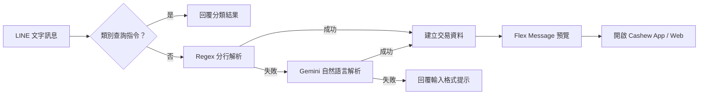

# 💰 LINE Cashew Bookkeeper

以 TypeScript、Express 與 LINE Messaging API 打造的 Cashew 記帳助手。使用者可以傳送固定格式或自然語言訊息，Bot 會解析日期、分類、金額與備註，回傳 Flex Message 預覽，再透過 App Link 將交易帶入 [Cashew](https://cashewapp.web.app/)。

## 核心功能

- 固定格式解析：支援日期、品項、金額、備註與多行交易。
- Gemini 自然語言備援：Regex 無法解析時，使用 Gemini 拆解單筆或多筆交易。
- 收入與支出分類：支出金額為負數、收入金額為正數。
- 動態分類表：可從 Google Sheet CSV 載入分類，具備 5 分鐘快取與本地靜態備援。
- 類別查詢：可列出全部分類，或用關鍵字搜尋主分類與子分類。
- 特殊記帳規則：支援阿君帳戶與信用卡回饋清單。
- Flex Message 預覽：支出金額顯示紅色、收入金額顯示綠色；AI 產生的結果會標示 `✨ Provided by Gemini`。
- 跨平台 Cashew Link：手機開啟 App Link，桌面環境使用 Web App。
- 台北時區：未指定日期時，以 `Asia/Taipei` 的今天為準。

## 處理流程



## 使用方式

### 基本格式

格式：

```text
日期(MMDD) 品項 金額:備註
```

日期與備註皆可省略：

```text
早餐 80:麥當勞
0408 高鐵 1490
```

也可以把日期放在第一行，讓後續交易共用：

```text
0510
高鐵 1490
晚餐 990
```

### Gemini 自然語言

當固定格式無法完整解析時，系統會改用 Gemini：

```text
昨天中午吃麥當勞 200
禮拜一晚餐 99，飲料 50
上週日吃喝 39，午餐 1000 跟阿君平分
```

Gemini 會嘗試拆解多筆交易、推算相對日期，並依現有分類表校正收入與支出的正負號。

### 收入

收入分類會輸出正數金額，例如：

```text
公司薪資 50000
獎金 3000
```

### 信用卡回饋

信用卡回饋屬於固定收入規則：

```text
Unicard 500
Ubear 300
```

輸出內容：

```ts
{
  title: 'Unicard',
  category: '錢錢來啦',
  subcategory: '信用卡回饋',
  amount: 500,
  account: '我的錢錢'
}
```

目前支援的回饋卡別：`Unicard`、`Ubear`、`大戶`、`Richart`、`eco永續卡`、`Cube`、`熊本熊`、`iLeo`。

### 阿君特殊規則

```text
阿君加 100
阿君午餐 100
```

- `阿君加 100`：`阿君抵加`、金額 `+100`、帳戶 `侯阿君`。
- 其他包含阿君的支出：`阿君仔`、金額為負數、帳戶 `侯阿君`。
- Gemini 亦支援「跟阿君平分」等自然語言拆帳。

### 查詢分類

支援的查詢前綴：`查`、`查詢`、`分類`、`選單`、`類別`、`!cat`、`/cat`。

```text
查
查 早餐
查 交通
查 信用卡回饋
```

- 沒有關鍵字時，列出全部收入與支出分類。
- 關鍵字可搜尋主分類或子分類。
- 查詢子分類「信用卡回饋」時，會額外列出所有回饋卡別。
- 卡名本身不是分類查詢關鍵字，例如 `查 Unicard` 不會命中分類。

## Google Sheet 分類表

設定 `GOOGLE_SHEET_CSV_URL` 後，系統會讀取公開 CSV。建議使用三欄格式：

```csv
type,category,subcategory
expense,飲食,早餐
expense,交通,高鐵
income,錢錢來啦,公司薪資
income,錢錢來啦,信用卡回饋
```

`type` 只接受：

- `expense`：支出，金額會轉為負數。
- `income`：收入，金額會轉為正數。

舊版的 `category,subcategory` 兩欄格式仍可使用，並會預設為支出。若遠端讀取失敗、內容為空或未設定 URL，系統會改用 `src/maps.ts` 內的靜態分類。

## 環境變數

在專案根目錄建立 `.env`：

```env
LINE_CHANNEL_ACCESS_TOKEN=你的_LINE_Channel_Access_Token
LINE_CHANNEL_SECRET=你的_LINE_Channel_Secret
CASHEW_WEB=https://你的-cashew-web-url
CASHEW_APP=https://你的-cashew-app-url

# 選用：啟用動態分類
GOOGLE_SHEET_CSV_URL=https://docs.google.com/spreadsheets/d/.../export?format=csv

# 選用：啟用 Gemini 自然語言解析與真實 AI 整合測試
GEMINI_API_KEY=你的_Gemini_API_Key
```

如果未設定 `GEMINI_API_KEY`，固定格式與分類查詢仍可使用，只會略過 Gemini 備援。

## 本地開發

需求：Node.js 20 以上，建議使用 Node.js 22。

```bash
npm install
npm run dev
```

預設服務位於 `http://localhost:3000`，根路徑 `/` 可用於健康檢查，LINE Webhook 路徑為 `/webhook`。

## 測試與建置

```bash
# 完全離線的單元測試
npm test

# 監看模式
npm run test:watch

# 真實連線 Gemini 與 Google Sheet
npm run test:integration

# TypeScript 建置
npm run build
```

一般 `npm test` 不會呼叫外部服務。`npm run test:integration` 會載入 `.env`，並實際消耗 Gemini API、連線 Google Sheet，因此適合手動或部署前執行。

## 專案結構

| 路徑                           | 說明                                             |
| ------------------------------ | ------------------------------------------------ |
| `src/index.ts`                 | Express、LINE Webhook 與 Regex → Gemini 備援流程 |
| `src/parser.ts`                | 固定格式解析、分類比對、類別查詢、Cashew Link    |
| `src/intelligence.ts`          | Gemini Prompt、結構化輸出與交易結果校正          |
| `src/maps.ts`                  | 收入／支出分類、Google Sheet、快取與特殊清單     |
| `src/helper.ts`                | Flex Message 內容與金額顏色                      |
| `src/types.ts`                 | 共用交易與分類型別                               |
| `src/**/*.test.ts`             | 離線單元測試                                     |
| `src/**/*.integration.test.ts` | 真實 Gemini／Google Sheet 整合測試               |

## 部署至 Vercel

專案已連接 GitHub 與 Vercel。推送 `main` 後，Vercel Git Integration 會自動建立 Production deployment。

部署前請在 Vercel Project Settings 設定與本地 `.env` 相同的必要環境變數，並確認 LINE Developers Console 的 Webhook URL 指向：

```text
https://你的-production-domain/webhook
```

## 技術棧

- TypeScript 6
- Express 5
- LINE Bot SDK
- Google Gen AI SDK（Gemini）
- Day.js
- Vitest

## License

ISC
